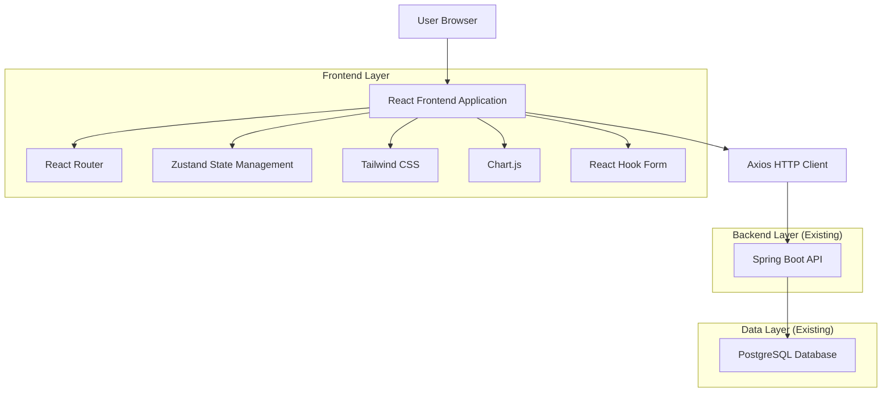
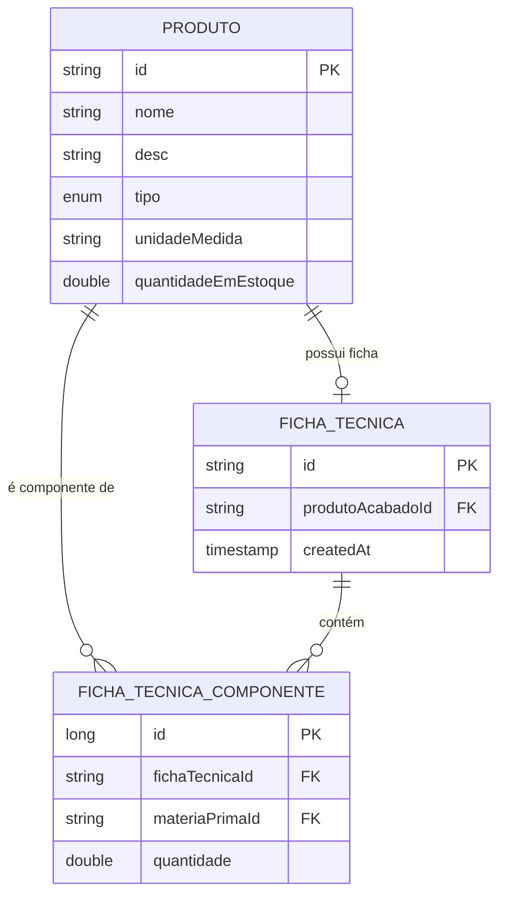

# Arquitetura Técnica - Frontend Sistema de Estoque Viza

## 1. Architecture design



## 2. Technology Description

- Frontend: React@18 + TypeScript@5 + Vite@5 + Tailwind CSS@3
- State Management: Zustand@4
- HTTP Client: Axios@1.6
- Charts: Chart.js@4 + react-chartjs-2@5
- Forms: React Hook Form@7 + Zod@3
- Icons: Lucide React@0.300
- Routing: React Router DOM@6
- UI Components: Headless UI@1.7
- Backend: Spring Boot API (existing at http://localhost:8080)

## 3. Route definitions

| Route | Purpose |
|-------|---------|
| / | Dashboard principal com métricas e gráficos em tempo real |
| /produtos | Gestão de produtos - listagem, cadastro, edição e exclusão |
| /produtos/novo | Formulário de cadastro de nova matéria-prima |
| /produtos/acabado/novo | Formulário de cadastro de produto acabado com ficha técnica |
| /estoque | Controle de estoque - entrada, saída e histórico de movimentações |
| /estoque/entrada | Formulário para registrar entrada de estoque (compras) |
| /estoque/saida | Formulário para registrar saída manual de estoque |
| /fichas-tecnicas | Visualização e gestão de fichas técnicas (receitas) |
| /fichas-tecnicas/:id | Detalhes de uma ficha técnica específica |
| /producao | Ordens de produção - criação, execução e histórico |
| /producao/nova | Formulário para criar nova ordem de produção |
| /producao/historico | Histórico de ordens de produção executadas |
| /relatorios | Dashboard de relatórios e análises |
| /relatorios/estoque | Relatório detalhado de estoque atual |
| /configuracoes | Configurações do sistema e perfil do usuário |
| /login | Página de autenticação do usuário |

## 4. API definitions

### 4.1 Core API

**Produtos - Gestão de matérias-primas e produtos acabados**

```
GET /api/produtos
```
Response:
| Param Name | Param Type | Description |
|------------|------------|-------------|
| id | string | ID único do produto (ex: "MP-001", "PA-001") |
| nome | string | Nome do produto |
| desc | string | Descrição detalhada |
| tipo | enum | MATERIA_PRIMA ou PRODUTO_ACABADO |
| unidadeMedida | string | Unidade (kg, L, un) |
| quantidadeEmEstoque | number | Quantidade atual em estoque |

```
POST /api/produtos
```
Request:
| Param Name | Param Type | isRequired | Description |
|------------|------------|------------|-------------|
| id | string | true | ID único do produto |
| nome | string | true | Nome do produto |
| desc | string | false | Descrição |
| tipo | enum | true | Tipo do produto |
| unidadeMedida | string | true | Unidade de medida |

```
POST /api/produtos/entrada
```
Request:
| Param Name | Param Type | isRequired | Description |
|------------|------------|------------|-------------|
| produtoId | string | true | ID do produto |
| quantidade | number | true | Quantidade a dar entrada |

**Produção - Produtos acabados e fichas técnicas**

```
POST /api/producao/produto-acabado
```
Request:
| Param Name | Param Type | isRequired | Description |
|------------|------------|------------|-------------|
| id | string | true | ID do produto acabado |
| nome | string | true | Nome do produto |
| desc | string | false | Descrição |
| unidadeMedida | string | true | Unidade de medida |
| componentes | array | true | Lista de componentes da receita |

Componente Object:
| Param Name | Param Type | isRequired | Description |
|------------|------------|------------|-------------|
| materiaPrimaId | string | true | ID da matéria-prima |
| quantidade | number | true | Quantidade necessária |

```
POST /api/producao/executar
```
Request:
| Param Name | Param Type | isRequired | Description |
|------------|------------|------------|-------------|
| produtoAcabadoId | string | true | ID do produto a produzir |
| quantidadeAProduzir | number | true | Quantidade a produzir |

## 5. Server architecture diagram

```mermaid
graph TD
    A[React Frontend] --> B[Axios HTTP Client]
    B --> C[Spring Boot Controllers]
    C --> D[Service Layer]
    D --> E[Repository Layer]
    E --> F[(PostgreSQL Database)]

    subgraph Frontend
        A
        G[Zustand Store]
        H[React Components]
        I[Custom Hooks]
    end

    subgraph Backend (Existing)
        C
        D
        E
    end

    A --> G
    A --> H
    A --> I
```

## 6. Data model

### 6.1 Data model definition



### 6.2 Frontend State Management

**Zustand Store Structure**

```typescript
// Store de Produtos
interface ProdutoStore {
  produtos: Produto[]
  loading: boolean
  error: string | null
  fetchProdutos: () => Promise<void>
  criarProduto: (produto: ProdutoRequestDTO) => Promise<void>
  deletarProduto: (id: string) => Promise<void>
  darEntrada: (produtoId: string, quantidade: number) => Promise<void>
}

// Store de Produção
interface ProducaoStore {
  fichasTecnicas: FichaTecnica[]
  ordensProducao: OrdemProducao[]
  loading: boolean
  criarProdutoAcabado: (dto: ProdutoAcabadoRequestDTO) => Promise<void>
  executarOrdem: (dto: OrdemProducaoRequestDTO) => Promise<void>
  verificarViabilidade: (produtoId: string, quantidade: number) => Promise<boolean>
}

// Store de UI
interface UIStore {
  sidebarOpen: boolean
  theme: 'light' | 'dark'
  notifications: Notification[]
  toggleSidebar: () => void
  addNotification: (notification: Notification) => void
}
```

**TypeScript Interfaces**

```typescript
interface Produto {
  id: string
  nome: string
  desc: string
  tipo: 'MATERIA_PRIMA' | 'PRODUTO_ACABADO'
  unidadeMedida: string
  quantidadeEmEstoque: number
}

interface FichaTecnica {
  id: string
  produtoAcabado: Produto
  componentes: FichaTecnicaComponente[]
}

interface FichaTecnicaComponente {
  id: number
  materiaPrima: Produto
  quantidade: number
}

interface OrdemProducaoRequestDTO {
  produtoAcabadoId: string
  quantidadeAProduzir: number
}
```