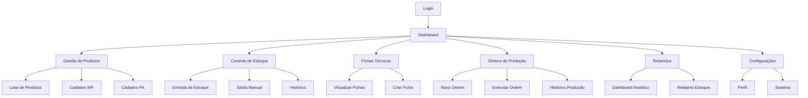

# Sistema de Controle de Estoque Viza - Frontend

## 1. Product Overview

Sistema web moderno e interativo para controle de estoque e produção da empresa Viza, desenvolvido em React com interface responsiva e intuitiva. O sistema permite gestão completa de matérias-primas, produtos acabados, fichas técnicas e ordens de produção com validação em tempo real.

O frontend consome uma API REST robusta desenvolvida em Spring Boot, oferecendo uma experiência de usuário fluida para operadores de estoque, gerentes de produção e administradores do sistema.

## 2. Core Features

### 2.1 User Roles

| Role | Registration Method | Core Permissions |
|------|---------------------|------------------|
| Operador de Estoque | Login com credenciais fornecidas | Pode visualizar produtos, dar entrada/saída de estoque, consultar relatórios básicos |
| Gerente de Produção | Login com credenciais elevadas | Pode criar produtos acabados, gerenciar fichas técnicas, executar ordens de produção |
| Administrador | Login administrativo | Acesso completo: CRUD de produtos, configurações do sistema, relatórios avançados |

### 2.2 Feature Module

Nossa aplicação de controle de estoque consiste nas seguintes páginas principais:

1. **Dashboard**: métricas em tempo real, gráficos de estoque, alertas de produtos em falta, resumo de produção diária.
2. **Gestão de Produtos**: listagem completa, cadastro de matérias-primas e produtos acabados, edição e exclusão com validações.
3. **Controle de Estoque**: entrada e saída de produtos, histórico de movimentações, relatórios de estoque atual.
4. **Fichas Técnicas**: criação e visualização de receitas, associação de componentes, cálculo automático de custos.
5. **Ordens de Produção**: criação de ordens, verificação de viabilidade, execução com baixa automática de estoque.
6. **Relatórios**: dashboards analíticos, gráficos de tendências, exportação de dados, relatórios personalizados.
7. **Configurações**: perfil do usuário, configurações do sistema, backup de dados.

### 2.3 Page Details

| Page Name | Module Name | Feature description |
|-----------|-------------|---------------------|
| Dashboard | Métricas Gerais | Exibir cards com totais de produtos, estoque baixo, produção do dia. Gráficos de pizza para distribuição de estoque |
| Dashboard | Alertas em Tempo Real | Mostrar notificações de produtos com estoque crítico, ordens pendentes, erros de produção |
| Dashboard | Gráfico de Tendências | Visualizar gráficos de linha com histórico de movimentações dos últimos 30 dias |
| Gestão de Produtos | Lista de Produtos | Tabela paginada com filtros por tipo, busca por nome/ID, ordenação por colunas |
| Gestão de Produtos | Cadastro de Matéria-Prima | Formulário com validação para ID, nome, descrição, unidade de medida |
| Gestão de Produtos | Cadastro de Produto Acabado | Formulário integrado com criação de ficha técnica, seleção de componentes |
| Gestão de Produtos | Edição e Exclusão | Modal de confirmação, validação de dependências, mensagens de erro claras |
| Controle de Estoque | Entrada de Estoque | Formulário para registrar compras, seleção de produto, quantidade, data |
| Controle de Estoque | Saída Manual | Formulário para baixas manuais com justificativa obrigatória |
| Controle de Estoque | Histórico de Movimentações | Tabela com filtros por período, tipo de movimentação, produto |
| Fichas Técnicas | Visualização de Receitas | Cards expandíveis mostrando componentes, quantidades, custos calculados |
| Fichas Técnicas | Criação de Ficha | Interface drag-and-drop para adicionar componentes, cálculo automático |
| Ordens de Produção | Nova Ordem | Seleção de produto, quantidade, verificação de viabilidade em tempo real |
| Ordens de Produção | Execução de Ordem | Confirmação com preview das baixas, execução com feedback visual |
| Ordens de Produção | Histórico de Produção | Lista de ordens executadas com detalhes e status |
| Relatórios | Dashboard Analítico | Gráficos interativos com Chart.js, filtros por período, exportação PDF/Excel |
| Relatórios | Relatório de Estoque | Tabela detalhada com valores, custos, rotatividade |
| Configurações | Perfil do Usuário | Edição de dados pessoais, alteração de senha, preferências |
| Configurações | Configurações do Sistema | Parâmetros gerais, backup automático, logs de auditoria |

## 3. Core Process

**Fluxo Principal do Operador de Estoque:**
O operador acessa o dashboard para visualizar o status geral, navega para gestão de produtos para cadastrar novas matérias-primas, utiliza o controle de estoque para registrar entradas de mercadorias e consulta relatórios para acompanhar movimentações.

**Fluxo do Gerente de Produção:**
O gerente verifica no dashboard os produtos disponíveis, acessa fichas técnicas para criar ou modificar receitas, navega para ordens de produção para planejar e executar a fabricação, e consulta relatórios analíticos para tomada de decisões.

**Fluxo do Administrador:**
O administrador monitora todas as atividades pelo dashboard, gerencia usuários e permissões nas configurações, analisa relatórios avançados e realiza manutenções do sistema.

## 4. User Interface Design

### 4.1 Design Style

- **Cores Primárias:** Azul corporativo (#2563eb), Verde sucesso (#16a34a), Vermelho alerta (#dc2626)
- **Cores Secundárias:** Cinza neutro (#64748b), Branco (#ffffff), Cinza claro (#f8fafc)
- **Estilo de Botões:** Rounded corners (8px), sombras sutis, estados hover/active bem definidos
- **Tipografia:** Inter como fonte principal (16px base), títulos em 24px/32px, labels em 14px
- **Layout:** Design baseado em cards, sidebar fixa, header com breadcrumbs, grid responsivo
- **Ícones:** Lucide React com estilo outline, tamanho padrão 20px, cores consistentes com o tema

### 4.2 Page Design Overview

| Page Name | Module Name | UI Elements |
|-----------|-------------|-------------|
| Dashboard | Cards de Métricas | Grid 2x2 responsivo, cards com ícones coloridos, números grandes (32px), fundo branco com bordas sutis |
| Dashboard | Gráficos | Charts com cores da paleta, tooltips interativos, legendas claras, altura fixa 300px |
| Gestão de Produtos | Tabela de Produtos | Tabela zebrada, headers fixos, ações em dropdown, paginação inferior, filtros no topo |
| Gestão de Produtos | Formulários | Layout em 2 colunas, labels acima dos campos, validação em tempo real, botões de ação no rodapé |
| Controle de Estoque | Formulário de Entrada | Card centralizado, campos organizados verticalmente, botão primário destacado |
| Fichas Técnicas | Cards de Receita | Cards expansíveis, lista de componentes com ícones, cálculos em destaque |
| Ordens de Produção | Interface de Criação | Stepper horizontal, preview da ordem, validação visual de estoque |
| Relatórios | Dashboard Analítico | Layout em grid, gráficos interativos, filtros em sidebar, exportação no header |

### 4.3 Responsiveness

O sistema é desenvolvido com abordagem mobile-first, utilizando Tailwind CSS para responsividade. Breakpoints principais: sm (640px), md (768px), lg (1024px), xl (1280px). A sidebar colapsa em menu hambúrguer em telas menores, tabelas se tornam scrolláveis horizontalmente, e cards se reorganizam em coluna única. Otimização para touch em dispositivos móveis com botões maiores e espaçamento adequado.